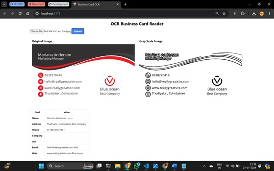

# OCR Business Card Reader

## Project Overview

This project is an AI-powered Optical Character Recognition (OCR) application designed to extract information from business cards. Users can upload an image of a business card, and the application will process the image to extract key information such as name, address, phone number, email, and company details. The extracted information is displayed in a structured format on the webpage, enhancing accessibility and usability.

## Features

- Upload business card images
- Image preprocessing for enhanced OCR accuracy
- Extraction of key details using Tesseract OCR
- Display of original and processed images
- Structured display of extracted information

## Technology Stack

### Frontend

- **ReactJS**: For building the user interface
- **Tailwind CSS**: For styling the application
- **Axios**: For making HTTP requests to the backend

### Backend

- **Node.js**: For server-side logic
- **Express.js**: For handling HTTP requests and routing
- **Multer**: For handling file uploads

### OCR Processing

- **Python**: For the OCR processing script
- **OpenCV**: For image preprocessing (grayscale conversion, noise reduction)
- **Pytesseract**: For text extraction from images

## Setup Instructions

### Prerequisites

- Node.js
- Python
- Tesseract OCR

### Installation

1. Clone the repository:

    ```sh
    git clone https://github.com/SivaPhoenix/businesses-card-ocr.git
    cd businesses-card-ocr
    ```

2. Install dependencies for the frontend:

    ```sh
    cd ocr-frontend
    npm install
    ```

3. Install dependencies for the backend:

    ```sh
    cd ocr-backend
    npm install
    ```

4. Set up the Tesseract OCR path in the `ocr.py` file:

    ```python
    pytesseract.pytesseract.tesseract_cmd = r'C:\Program Files\Tesseract-OCR\tesseract.exe'  # Update this path as needed
    ```

### Running the Application

1. Start the backend server:

    ```sh
    cd ocr-backend
    node server.js
    ```

2. Start the frontend development server:

    ```sh
    cd ocr-frontend
    npm run dev
    ```

3. Open your browser and navigate to `http://localhost:5173`

## Project Structure

```plaintext
.
├── ocr-frontend
│   ├── public
│   ├── src
│   │   ├── components
│   │   │   ├── ImageDisplay.jsx
│   │   │   └── OCRResultTable.jsx
│   │   ├── App.jsx
│   │   └── index.css
│   ├── package.json
│   └── ...
├── ocr-backend
│   ├── images
│   ├── ocr.py
│   ├── server.js
│   ├── package.json
│   └── ...
└── README.md
```


### Output

